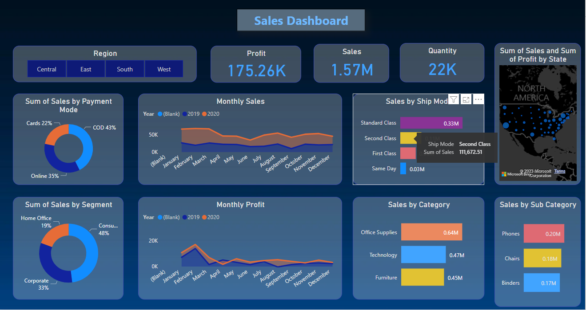

# 📊 Sales Performance Dashboard – Power BI Project

This repository contains an interactive **Power BI dashboard** built from a large dataset to analyze **sales performance**, **customer behavior**, and **regional trends** across multiple dimensions. This project showcases my ability to extract actionable business insights from complex data, design intuitive visualizations, and support strategic decision-making using data storytelling.

---

## 📁 Dataset Overview

The dataset included thousands of sales transactions with fields such as:

* **Order Details**: Order Date, Region, Segment, Quantity, Discount, Sales, Profit
* **Customer Information**: Segment, Payment Method, Country, and City
* **Product Data**: Category, Sub-Category, Ship Mode
* **Temporal Data**: Year, Month, Date of Order and Shipment

---

## 🎯 Objectives

* Monitor key performance indicators like **total profit**, **sales**, and **quantity sold**
* Identify **top-performing regions**, **segments**, and **categories**
* Analyze customer preferences by **payment mode**, **shipping mode**, and **product type**
* Compare year-over-year performance for **sales** and **profit**
* Provide insights to support marketing, logistics, and product decisions

---

## 📌 Key Insights from the Dashboard

### ✅ Overall Performance Summary

* **Total Profit**: \$175.26K
* **Total Sales**: \$1.57M
* **Total Quantity Sold**: 22K items
  These KPIs offer a quick snapshot of the business health.

---

### 🌍 Regional Analysis

* Visual region filters (Central, East, South, West) allow decision-makers to drill down into specific geographical zones.
* The **map visualization** shows state-wise distribution of **sales and profit**, helping identify key markets.

---

### 💳 Payment Mode Preferences

* **COD (Cash on Delivery)** is the most preferred method (43%)
* Followed by **Online Payments (35%)** and **Cards (22%)**
* Indicates the need for robust COD logistics infrastructure.

---

### 🚚 Shipping Mode Performance

* **Standard Class** and **Second Class** dominate the shipping choices, with over \$300K and \$111K in sales respectively.
* This insight helps in negotiating better terms with standard shipping partners.

---

### 📅 Monthly Trends

* Year-over-year **monthly sales** and **profits** are visualized to detect seasonal patterns.
* Sales peak during early Q1 and Q4, while profits show fluctuation, especially in mid-year.

---

### 🧑 Customer Segment Analysis

* **Consumer Segment** accounts for 48% of sales.
* Followed by **Corporate (33%)** and **Home Office (19%)**
* Marketing efforts can be tailored accordingly to boost corporate and home office sales.

---

### 🛒 Sales by Category

* **Office Supplies** lead in revenue (\$640K), followed by:

  * **Technology** (\$470K)
  * **Furniture** (\$450K)
* Focus on high-margin tech products can drive profit growth.

---

### 🧱 Sub-Category Insights

* **Phones**, **Chairs**, and **Binders** are the top sub-categories
* Each shows over \$170K in sales, highlighting them as bestsellers.

---

## 📈 Skills Demonstrated

* 🔹 **Data Cleaning and Transformation** (Power Query, DAX)
* 🔹 **Data Modeling** (relationship building across tables)
* 🔹 **Interactive Dashboard Design** (bookmarks, slicers, drill-throughs)
* 🔹 **Time Intelligence** (YTD, YoY comparison)
* 🔹 **Business Intelligence Storytelling**

---

## 🚀 Future Improvements

* Add **forecasting** using Power BI’s built-in analytics
* Integrate with **live data sources** for real-time updates
* Export key metrics to PDF or PowerPoint for executive summaries

---

## 🧠 Takeaway

This Power BI dashboard helped convert raw sales data into **actionable insights** for business leaders. It supports marketing, logistics, inventory management, and financial planning, and demonstrates my ability to handle end-to-end data analysis using Power BI.

---

## 📫 Contact

If you're interested in collaborating or hiring for data projects, feel free to connect:

🔗 [LinkedIn](https://www.linkedin.com/in/ishmam-faruki-67b698170/)
🌐 [Portfolio](https://iambeep.github.io/ishmamfaruki.github.io/)

